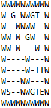

# EECS 738 Project 4: Treasure Hunters Inc.

### Submission by Benjamin Wyss

Implementing Value Iteration and Monte Carlo Reinforcement Learning Policies to Play a Map Traversal Game

## The Map Traversal Game

The goal of the map traversal game is to move from the starting location to the exit location within a 2-dimensional grid while accumulating the highest score possible. Every move that the player makes penalizes their score, and the maps additionally contain single-use score-boosting gold pickups and score-dropping traps. A sample map is depicted below:

Map Legend:

\- : Passages that the player can walk through  
W : Walls that the player cannot walk through  
S : Starting location  
E : Exit location  
G : Gold that boosts score  
T : Trap that damages score

Additional maps are located in the [maps](maps) folder.

Scoring:

The game's starting score, gold score, trap penalty, and move penalty are all configurable when instantiating a member of the [dungeon.py](dungeon.py) class, but they have the following default values:

Starting Score : +100  
Gold Score : +100  
Trap Penalty : -100  
Move Penalty : -5

## Process

Value Iteration and Monte Carlo reinforcement learning techniques should be able to learn the map traversal game programatically and execute their determined optimal policies to maximize their final scores in each game map.

Value Iteration is implemented in [valueIteration.py](valueIteration.py). Training a value iteration policy to play the map traversal game involves determining a steady-state value matrix representing the expected score value of each tile in a given map. This process iterates over each map tile until the value matrix converges, updating each tile's expected value based on the score achieved by moving to the tile and the maximum expected value of adjacent tiles. After training on a map, the value iteration policy can be used to play the map traversal game by making each choice that yields the maximum possible expected value. One challenge in using this policy is that it does not account for changes to the map that occur when picking up gold or triggering a trap. This challenge is overcome by simply retraining the value matrix whenever a change to the map occurs.

Monte Carlo is implemented in [monteCarlo.py](monteCarlo.py). Training a Monte Carlo policy to play the map traversal game involves executing large amounts of random traversals of a given map and tracking an expected score value matrix related to the score of each move in each random traversal. Each move's score is also used to update the values of previous moves in a random traversal so that the policy learns to move towards score-boosting moves and away form score-dropping moves. Just like value iteration, playing the map traversal game with the monte carlo policy involves making each choice that yields the maximum possible expected value. To combat the monte carlo policy's tendency to repeat loops of moves that do not progress the map traversal game in any meaningful way, the value matrix is also updated as the game is played.

## Results

To run the program, execute [main.py](main.py) using python3. Upon execution, the program loads each map into a game, and then trains and executes each policy against each map. The policies' value matrices and moves are all printed out for visibility and analysis. The program lastly outputs the final scores achieved by each policy on each map. The final scores of a sample run are depicted below:

Overall, the value iteration policy performed very well in each map, obtaining the best possible score in 4/5 maps and a slightly suboptimal score in the fifth map. The value iteration policy always moves towards the closest score-boosting series of moves or towards the exit if no score-boosting moves remain. For most maps, this results in an optimal policy. In [the fifth map](maps/map4.txt), however, optimal score is achieved by picking up the farther gold that is below the starting location before picking up the closer gold that is above the starting location. This ordering of moves saves 4 moves in total, meaning that the value iteration policy's score is 20 points below the maximum possible score. This occurs because the value iteration policy is a little shortsighted and does not account for how maps change when gold is picked up and traps are triggered until *after* the map has already changed.

The monte carlo policy performed worse, obtaining the best possible score in 2/5 maps, and significantly suboptimal scores in 3/5 maps. The monte carlo policy tends to try and move towards the exit location as fast as possible, and mostly ignores gold and traps along the way. This seems to be because random traversals are very inefficient in moving towards beneficial moves, instead they tend to linger in areas and execute many useless moves. These useless moves negatively impact the policy's value matrix because they decrease the impact of gold and traps in the value matrix. While this issue can be mildly offset by adopting a first-visit only value matrix update scheme, I found that this alteration only sometimes improves overall score and still fails to yield optimal results in maps where searching for gold is the optimal strategy. In general, the monte carlo training process results in a very greedy exit-oriented policy that only performs optimally in maps where moving to the exit as fast as possible is the optimal strategy.

## Conclusion

This project was very helpful in deepening my understanding of reinforcement learning strategies, implementations, and tradeoffs. While no policy implemented was perfect, analyzing each policy to determine their overall strategies, pros, and cons was a great learning experience. All things considered, the value iteration policy performed great in most cases, and I am satisfied with the results I achieved.
